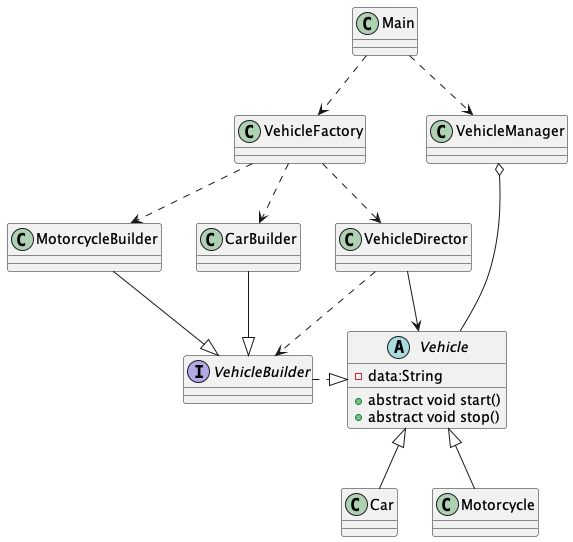

# OOP Lab 1 - Vehicle Management System

## Table of Contents

- [Project Description](#project-description)
- [Class Descriptions](#class-descriptions)
- [UML Diagram](#uml-diagram)

## Project Description

This project is an implementation of a Vehicle Management System using Object-Oriented Programming principles. It includes various types of vehicles and provides functionality to build, manage, and display these vehicles. The project demonstrates the use of design patterns such as Builder and Singleton.

## Class Descriptions

### Main Class

- **`Main`**: This is the entry point of the application. It demonstrates the creation and management of vehicles using `VehicleFactory` and `VehicleManager`.

### Vehicle Hierarchy

- **`Vehicle`**: An abstract class representing a generic vehicle. It includes properties like wheels, body, engine, model, and type, and abstract methods for vehicle actions such as start, stop, forward, and back.
- **`Car`**: A concrete implementation of the `Vehicle` class representing a car.
- **`Motorcycle`**: A concrete implementation of the `Vehicle` class representing a motorcycle.

### Builders

- **`VehicleBuilder`**: An interface defining the methods required to build a `Vehicle`.
- **`CarBuilder`**: A concrete builder implementing `VehicleBuilder` to construct `Car` objects.
- **`MotorcycleBuilder`**: A concrete builder implementing `VehicleBuilder` to construct `Motorcycle` objects.

### Director

- **`VehicleDirector`**: A class that uses a `VehicleBuilder` to construct a `Vehicle` with specified properties.

### Factory

- **`VehicleFactory`**: A factory class responsible for creating different types of vehicles using the `VehicleDirector` and various `VehicleBuilder` implementations.

### Manager

- **`VehicleManager`**: A singleton class responsible for managing a collection of `Vehicle` objects.

## UML Diagram

